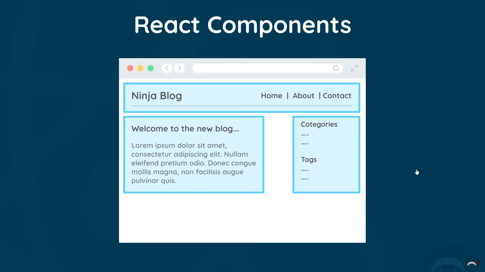
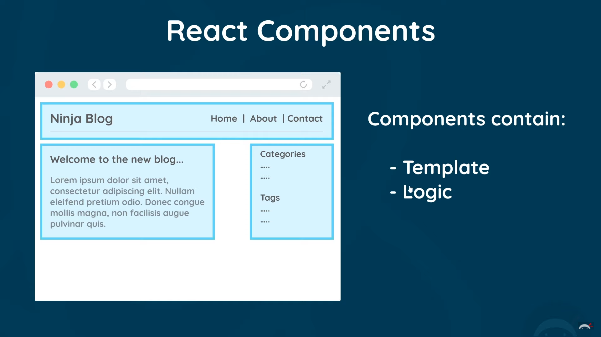
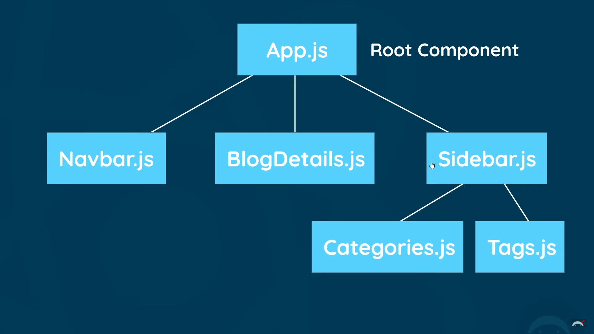
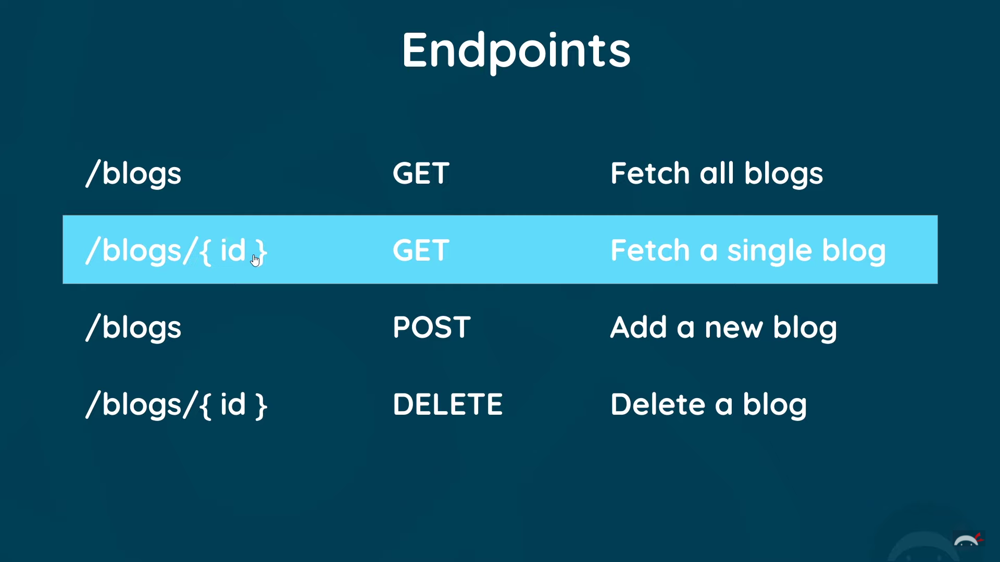
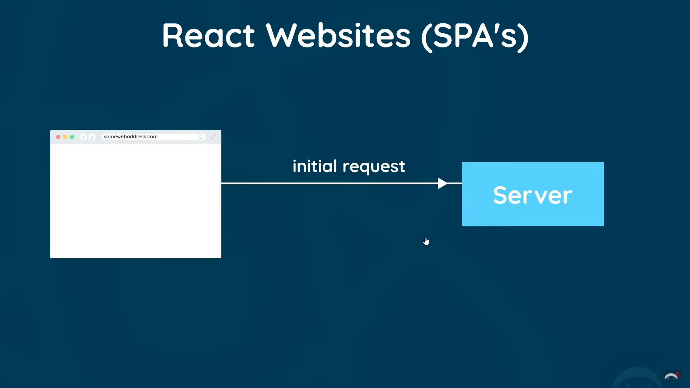
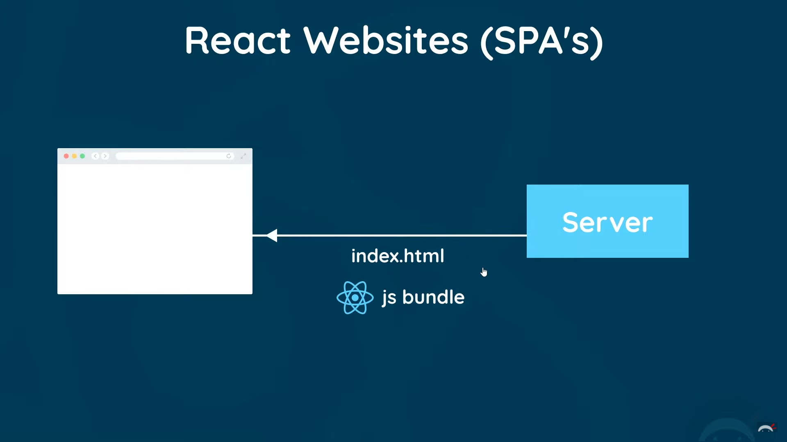
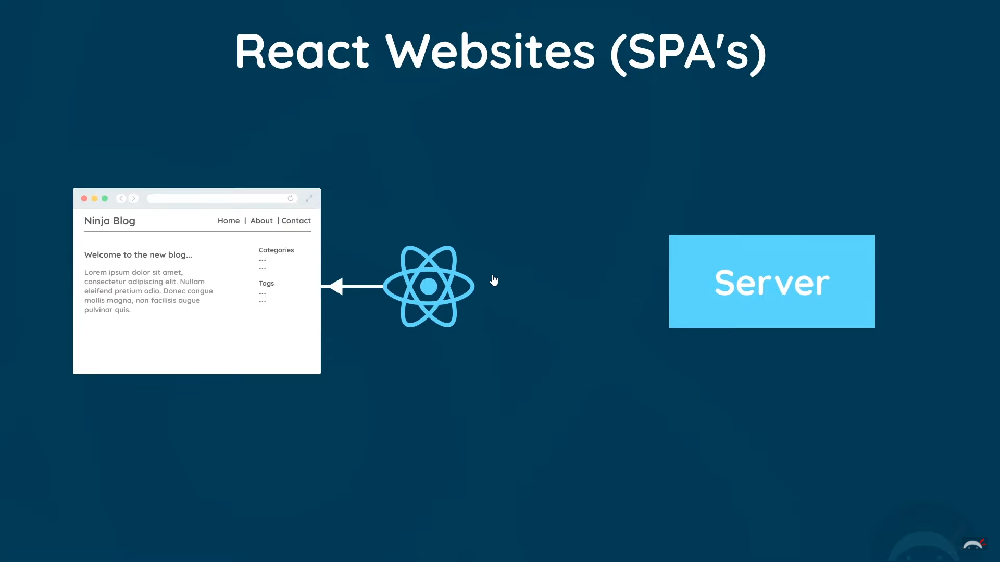
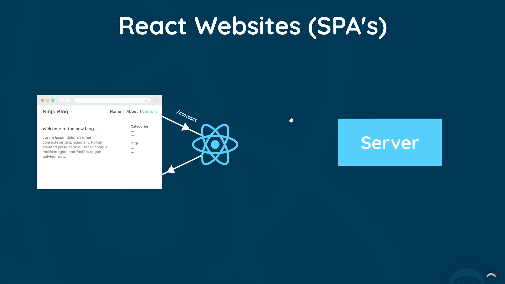
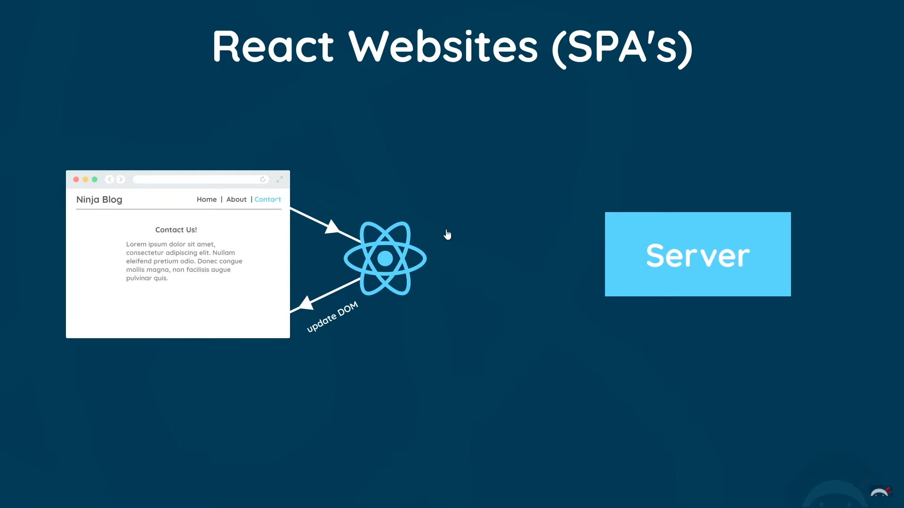
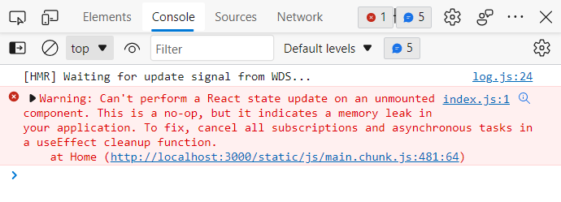

# Full Modern React Tutorial

## Creating a React Application

```bash
npx create-react-app dojo-blog
```

#### Directory Listing:

- node_modules: dependencies directory
- public: dışarıya açık, websitesinde gözüken kısım
- src: kod kısmı

---

index.html dosyası içinde şöyle bir kısım var:

```html
<div id="root"></div>
```

tüm kodlarımız `root` id'si olan bu div'e inject ediliyor.

---

Projeyi ilk kurduğumuzda `node_modules` şeklinde bir klasör oluşturuyor. Bu klasör tüm proje gereksinimliliklerini içeriyor. Eğer bu klasörü silersek projeyi çalıştıramayız.

GitHub'a proje yüklerken bu `node_modules` klasörü .gitignore dosyası içinde olduğundan yüklenmez. Eğer GitHub'dan bir proje indirip `npm run start` ile çalıştırmaya kalkarsak hata `node_modules` klasörü olmayacağından dolayı hata alırız.

`node_modules` klasörünü manuel olarak yüklemek için aşağıdaki komutu çalıştırıyoruz:

```bash
npm install
```

Projeyi başlatmak için:

```bash
npm run start
```

## Video 3 - Components & Templates





src/App.js

```js
// import logo from './logo.svg';
import "./App.css";

function App() {
  return (
    <div className="App">
      <div className="content">
        <h1>App Component</h1>
      </div>
    </div>
  );
}

export default App;
```

## Video 4 - Dynamic Values in Templates

```js
// import logo from './logo.svg';
import "./App.css";

function App() {
  const title = "Welcome to the new blog";
  const likes = 50;
  // const person = { name: 'yoshi', age: 30 };
  const link = "http://www.google.com";

  return (
    <div className="App">
      <div className="content">
        <h1>{title}</h1>
        <p>Liked {likes} times</p>

        {/* <p>{ person }</p> */}

        <p>{10}</p>
        <p>{"hello, ninjas"}</p>
        <p>{[1, 2, 3, 4, 5]}</p>
        <p>{Math.random() * 10}</p>

        <a href={link}>Google Site</a>
      </div>
    </div>
  );
}

export default App;
```

## Video 5 - Multiple Components



App.js

```js
// import logo from './logo.svg';
import "./App.css";
import Navbar from "./Navbar";
import Home from "./Home";

function App() {
  const title = "Welcome to the new blog";
  const likes = 50;
  // const person = { name: 'yoshi', age: 30 };
  const link = "http://www.google.com";

  return (
    <div className="App">
      <Navbar />
      <div className="content">
        <Home />
      </div>
    </div>
  );
}

export default App;
```

Navbar.js

```js
const Navbar = () => {
  return (
    <nav className="navbar">
      <h1>The Dojo Blog</h1>
      <div className="links">
        <a href="/">Home</a>
        <a href="/create">New Blog</a>
      </div>
    </nav>
  );
};

export default Navbar;
```

Home.js

```js
const Home = () => {
  return (
    <div className="home">
      <h2>Homepage</h2>
    </div>
  );
};

export default Home;
```

Kurduğumuz eklenti ile `sfc` yazarak hızlı bir şekilde component setup'ı yapabiliyoruz.

## Video 6 - Adding Styles

index.css

```css
@import url("https://fonts.googleapis.com/css2?family=Quicksand:wght@300;400;500;600;700&display=swap");

/* base styles */
* {
  margin: 0;
  font-family: "Quicksand";
  color: #333;
}
.navbar {
  padding: 20px;
  display: flex;
  align-items: center;
  max-width: 600px;
  margin: 0 auto;
  border-bottom: 1px solid #f2f2f2;
}
.navbar h1 {
  color: #f1356d;
}
.navbar .links {
  margin-left: auto;
}
.navbar a {
  margin-left: 16px;
  text-decoration: none;
  padding: 6px;
}
.navbar a:hover {
  color: #f1356d;
}
.content {
  max-width: 600px;
  margin: 40px auto;
  padding: 20px;
}
```

Navbar.js

```js
const Navbar = () => {
  return (
    <nav className="navbar">
      <h1>The Dojo Blog</h1>
      <div className="link">
        <a href="/">Home</a>
        <a href="/create">New Blog</a>
        {/* Inline Styling */}
        {/* <a href="/create" style={{
                    color: "white",
                    backgroundColor: "#f1356d",
                    borderRadius: '8px'
                }}>New Blog</a> */}
        {/* Inline Styling */}
      </div>
    </nav>
  );
};

export default Navbar;
```

## Video 7 - Click Events

Home.js

```js
const Home = () => {
  // otomatik olarak event object verilir fonksiyona
  const handleClick = (e) => {
    console.log("hello, ninjas");
  };

  const handleClickAgain = (name, e) => {
    console.log("hello " + name, e.target); // DOM eğitimindeki gibi
  };

  return (
    <div className="home">
      <h2>Homepage</h2>
      <button onClick={handleClick}>Click me</button>
      <button onClick={(e) => handleClickAgain("mario", e)}>
        Clicke me again
      </button>
    </div>
  );
};

export default Home;
```

## Video 8 - useState Hook

When we need a reactive value something that might change at some point we use the `useState` hook to do that.

Aldığımız destructured listin ilk elemanı, verdiğimiz değişken; ikincisi ise onu değiştiren fonksiyon.

```js
import { useState } from 'react';

const [name, setName] = useState('mario');
const [age, setAge] = useState(25);
```

Home.js
```js
import { useState } from 'react';

const Home = () => {
  // let name = 'mario';
  const [name, setName] = useState('mario');
  const [age, setAge] = useState(25);

  // otomatik olarak event object verilir fonksiyona
  const handleClick = (e) => {
    // name = 'luigi';
    // console.log(name) // luigi yazdırmasına rağmen, template'de update yapmıyor
    
    setName('luigi'); // this value is reactive
    setAge(30);
  };

  return (
    <div className="home">
      <h2>Homepage</h2>
      <p>{ name } is { age } years old</p>
      <button onClick={handleClick}>Click me</button>
    </div>
  );
};

export default Home;
```

## Video 10 - Outputting Lists

Home.js
```js
import { useState } from "react";

const Home = () => {
  const [blogs, setBlogs] = useState([
    { title: "My new website", body: "lorem ipsum...", author: "mario", id: 1 },
    { title: "Welcome Party", body: "lorem ipsum...", author: "yoshi", id: 2 },
    { title: "Web dev top tips", body: "lorem ipsum...", author: "mario", id: 3},
  ]);
  return (
    <div className="home">
      {blogs.map((blog) => (
        <div className="blog-preview" key={blog.id}>
          <h2>{ blog.title }</h2>
          <p>Written by { blog.author }</p>
        </div>
      ))}
    </div>
  );
};

export default Home;
```

index.css (added)
```css
/* blog previews / list */
.blog-preview {
  padding: 10px 16px;
  margin: 20px 0;
  border-bottom: 1px solid #fafafa;
}
.blog-preview:hover {
  box-shadow: 1px 3px 5px rgba(0,0,0,0.1);
}
.blog-preview h2 {
  font-size: 20px;
  color: #f1356d;
  margin-bottom: 8px;
}
```

## Video 11 - Props

Django'da, templatelere parametre göndermek ile çok benzer şeyler. Bir component'dan diğerine parametre göndermek için kullanılıyor.

Home.js
```js
import { useState } from "react";
import BlogList from "./BlogList";

const Home = () => {
  const [blogs, setBlogs] = useState([
    { title: "My new website", body: "lorem ipsum...", author: "mario", id: 1 },
    { title: "Welcome Party", body: "lorem ipsum...", author: "yoshi", id: 2 },
    { title: "Web dev top tips", body: "lorem ipsum...", author: "mario", id: 3},
  ]);
  return (
    <div className="home">
      <BlogList blogs={blogs} title="All Blogs!" /> {/*This is a prop*/}
    </div>
  );
};

export default Home;
```

BlogList.js
```js
// const BlogList = (props) => {
  // const blogs = props.blogs;
  // const title = props.title;
const BlogList = ({blogs, title}) => {


  return (
    <div className="blog-list">
      <h2>{title}</h2>
      {blogs.map((blog) => (
        <div className="blog-preview" key={blog.id}>
          <h2>{blog.title}</h2>
          <p>Written by {blog.author}</p>
        </div>
      ))}
    </div>
  );
};

export default BlogList;
```

## Video 12 - Reusing Components

Home.js
```js
import { useState } from "react";
import BlogList from "./BlogList";

const Home = () => {
  const [blogs, setBlogs] = useState([
    { title: "My new website", body: "lorem ipsum...", author: "mario", id: 1 },
    { title: "Welcome Party", body: "lorem ipsum...", author: "yoshi", id: 2 },
    { title: "Web dev top tips", body: "lorem ipsum...", author: "mario", id: 3},
  ]);
  return (
    <div className="home">
      <BlogList blogs={blogs} title="All Blogs!" /> {/*This is a prop*/}
      <BlogList blogs={blogs.filter((blog) => {return blog.author === "mario"})} title="Mario's Blogs!" /> {/*This is a prop*/}
    </div>
  );
};

export default Home;
```

## Video 13 - Functions as Props

Home.js
```js
import { useState } from "react";
import BlogList from "./BlogList";

const Home = () => {
  const [blogs, setBlogs] = useState([
    { title: "My new website", body: "lorem ipsum...", author: "mario", id: 1 },
    { title: "Welcome Party", body: "lorem ipsum...", author: "yoshi", id: 2 },
    { title: "Web dev top tips", body: "lorem ipsum...", author: "mario", id: 3},
  ]);

  const handleDelete = (id) => {
    const newBlogs = blogs.filter(blog => blog.id !== id);
    setBlogs(newBlogs);
  }

  return (
    <div className="home">
      <BlogList blogs={blogs} title="All Blogs!" handleDelete={handleDelete} /> {/*This is a prop*/}
    </div>
  );
};

export default Home;
```

BlogList.js
```js
const BlogList = ({ blogs, title, handleDelete }) => {
  return (
    <div className="blog-list">
      <h2>{title}</h2>
      {blogs.map((blog) => (
        <div className="blog-preview" key={blog.id}>
          <h2>{blog.title}</h2>
          <p>Written by {blog.author}</p>
          <button onClick={() => handleDelete(blog.id)}>delete blog</button>
        </div>
      ))}
    </div>
  );
};

export default BlogList;
```

## Video 14 - useEffect Hook

useEffect hook is a way to run code on every render.

Home.js
```js
import { useState, useEffect } from "react";
import BlogList from "./BlogList";

const Home = () => {
  const [blogs, setBlogs] = useState([
    { title: "My new website", body: "lorem ipsum...", author: "mario", id: 1 },
    { title: "Welcome Party", body: "lorem ipsum...", author: "yoshi", id: 2 },
    { title: "Web dev top tips", body: "lorem ipsum...", author: "mario", id: 3},
  ]);

  const handleDelete = (id) => {
    const newBlogs = blogs.filter(blog => blog.id !== id);
    setBlogs(newBlogs);
  }

  useEffect(() => {
    console.log('use effect ran');
    console.log(blogs);
  });

  return (
    <div className="home">
      <BlogList blogs={blogs} title="All Blogs!" handleDelete={handleDelete} /> {/*This is a prop*/}
    </div>
  );
};

export default Home;
```

## Video 15 - useEffect Dependencies

Home.js
```js
import { useState, useEffect } from "react";
import BlogList from "./BlogList";

const Home = () => {
  const [blogs, setBlogs] = useState([
    { title: "My new website", body: "lorem ipsum...", author: "mario", id: 1 },
    { title: "Welcome Party", body: "lorem ipsum...", author: "yoshi", id: 2 },
    {
      title: "Web dev top tips",
      body: "lorem ipsum...",
      author: "mario",
      id: 3,
    },
  ]);

  const [name, setName] = useState("mario");

  const handleDelete = (id) => {
    const newBlogs = blogs.filter((blog) => blog.id !== id);
    setBlogs(newBlogs);
  };

  // useEffect(() => {
  //   console.log("use effect ran");
  //   console.log(blogs);
  // }, []);
  // what this does an empty dependency array is make sure that this hook
  // only runs the function after the first initial render.

  useEffect(() => {
    console.log("use effect ran");
    console.log(name);
  }, [name]); // this is a dependency.

  return (
    <div className="home">
      <BlogList blogs={blogs} title="All Blogs!" handleDelete={handleDelete} />{" "}
      {/*This is a prop*/}
      <button
        onClick={() => {
          setName("luigi");
        }}
      >
        change name
      </button>
      <p>{name}</p>
    </div>
  );
};

export default Home;
```

## Video 16 - Using JSON Server

To start the json server:
```powershell
npx json-server --watch data/db.json --port 8000
```

This JSON server provides us some endpoints:



## Video 17 - Fetching Data with useEffect

Home.js
```js
import { useState, useEffect } from "react";
import BlogList from "./BlogList";

const Home = () => {
  const [blogs, setBlogs] = useState(null);

  const [name, setName] = useState("mario");

  useEffect(() => {
    fetch("http://localhost:8000/blogs")
      .then((res) => {
        return res.json();
      })
      .then((res) => {
        // setBlogs(res.blogs);
        console.log(res);
        setBlogs(res);
      });
  }, []);
  // [] means only ever fire this function once on the initial render not whenever the data changes

  return (
    <div className="home">
      {blogs && <BlogList blogs={blogs} title="All Blogs!" />}
      {/* buradaki && işareti, önce soldaki kısma bakıyor eğer false ise sağı
      hiç evaluate etmiyor soldakini işliyor eğer true ise sadece sağdakini
      evaluate ediyor*/}
      <button
        onClick={() => {
          setName("luigi");
        }}
      >
        change name
      </button>
      <p>{name}</p>
    </div>
  );
};

export default Home;
```

## Video 18 - Conditional Loading Message

Home.js
```js
import { useState, useEffect } from "react";
import BlogList from "./BlogList";

const Home = () => {
  const [blogs, setBlogs] = useState(null);
  const [isPending, setIsPending] = useState(true);

  useEffect(() => {
    setTimeout(() => {
      fetch("http://localhost:8000/blogs")
        .then((res) => {
          return res.json();
        })
        .then((res) => {
          setBlogs(res);
          setIsPending(false);
        });
    }, 1000);
  }, []);

  return (
    <div className="home">
      {isPending && <div>Loading...</div>}
      {blogs && <BlogList blogs={blogs} title="All Blogs!" />}
    </div>
  );
};

export default Home;
```

## Video 19 - Handling Fetch Errors

Home.js
```js
import { useState, useEffect } from "react";
import BlogList from "./BlogList";

const Home = () => {
  const [blogs, setBlogs] = useState(null);
  const [isPending, setIsPending] = useState(true);
  const [error, setError] = useState(null);

  useEffect(() => {
    setTimeout(() => {
      fetch("http://localhost:8000/blogs")
        .then((res) => {
          if (!res.ok) {
            throw Error("could not fetch the data for that resource");
          }
          return res.json();
        })
        .then((res) => {
          setBlogs(res);
          setIsPending(false);
          setError(null);
        })
        .catch((err) => {
          setIsPending(false);
          setError(err.message);
        });
    }, 1000); // 1 saniye = 1000 milisaniye
  }, []);

  return (
    <div className="home">
      {error && <div>{error}</div>}
      {isPending && <div>Loading...</div>}
      {blogs && <BlogList blogs={blogs} title="All Blogs!" />}
    </div>
  );
};

export default Home;
```

## Video 20 - Making a Custom Hook

Custom hooks in react need to start with this word `use` (i.e. useFetch).

Kodumuzun daha kullanışlı olabilmesi için Home.js içerisinde kullandığımız useEffect içinde fetch işlemini, yeni bir fonksiyon gibi başka dosyaya (useFetch) aktarıp `use` ile başlayan `useFetch` isimli fonksiyon oluşturup içine aktarıyoruz. Böylelikle `useFetch` fonksiyonunu import edip istediğimiz zaman kullanabiliriz.

### useFetch.js
```js
import { useState, useEffect } from "react";

function useFetch(url) {
  const [data, setData] = useState(null);
  const [isPending, setIsPending] = useState(true);
  const [error, setError] = useState(null);

  useEffect(() => {
    setTimeout(() => {
      fetch(url)
        .then((res) => {
          if (!res.ok) {
            throw Error("could not fetch the data for that resource");
          }
          return res.json();
        })
        .then((data) => {
          setData(data);
          setIsPending(false);
          setError(null);
        })
        .catch((err) => {
          setIsPending(false);
          setError(err.message);
        });
    }, 1000);
  }, [url]); // url parametresine ihtiyacımız olduğundan dolayı, dependency olarak ekliyoruz.

  return { data, isPending, error };
}

export default useFetch;
```

### Home.js
```js
import { useState, useEffect } from "react";
import BlogList from "./BlogList";
import useFetch from "./useFetch";

const Home = () => {
  const { data: blogs, isPending, error } = useFetch("http://localhost:8000/blogs");
       // data'yı blogs olarak al (grab the data but call it blogs)
  return (
    <div className="home">
      {error && <div>{error}</div>}
      {isPending && <div>Loading...</div>}
      {blogs && <BlogList blogs={blogs} title="All Blogs!" />}
    </div>
  );
};

export default Home;
```

## Video 21 - The React Router







The first thing we need to do is install the react router package because it's not a part of the core react library now to do this we need npm.

```bash
npm install react-router-dom@5
```

`@5` kısmı sürümü belirtiyor.

### App.js
```js
import Navbar from "./Navbar";
import Home from "./Home";
import { BrowserRouter as Router, Route, Switch } from "react-router-dom";

function App() {
  return (
    <Router>
      <div className="App">
        <Navbar />
        <div className="content">
          {/* All of our routes
          go inside Switch Component
          */}
          <Switch>
            <Route path="/">
              <Home />
            </Route>
          </Switch> 
          {/*
          Switch component makes sure that
          only one route shows at any one time
          */}
        </div>
      </div>
    </Router>
  );
}

export default App;
```

## Video 22 - Exact Match Routes

### App.js
```js
import Navbar from "./Navbar";
import Home from "./Home";
import { BrowserRouter as Router, Route, Switch } from "react-router-dom";
import Create from "./Create";

function App() {
  return (
    <Router>
      <div className="App">
        <Navbar />
        <div className="content">
          <Switch>
            <Route exact path="/">
              <Home />
            </Route>
            <Route path="/create">
              <Create />
            </Route>
          </Switch>
        </div>
      </div>
    </Router>
  );
}

export default App;
```

Normalde `/create` route'ına istek attığımızda, `/create` dizini `/` in altında olduğundan `/create` e gitmez `/` e gider, bundan kurtulmak için **exact** keyword unu kullandık.

### Create.js
```js
const Create = () => {
  return (
    <div className="create">
      <h2>Add a New Blog</h2>
    </div>
  );
};

export default Create;
```

Yukarıdaki `Create` component inin **css**ini ayarlamasak bile, `index.js` içerisinde `index.css` import ettiğimizden ve App componentimizin de aslında index.js içerisinde bir alt component olduğu için, `index.css` içerisindeki style lar `Create` component imiz için de uygulanıyor.

React üzerinde farklı route'a istek atarken sunucuya tekrardan istek gitmemesi lazım ancak şuanki durumda gidiyor onu da sonraki videoda halledicez.

## Video 23 - Router Links

Normalde
```html
<a href="...">...</a>
```
şeklinde yazdığımız kısmı
```html
<Lint to="...">...</Link>
```
olacak şekilde değiştiriyoruz.

### Navbar.js
```js
import { Link } from 'react-router-dom';

const Navbar = () => {
  return (
    <nav className="navbar">
      <h1>The Dojo Blog</h1>
      <div className="links">
        {/* <a href="/">Home</a>
        <a href="/create">New Blog</a> */}
        <Link to="/">Home</Link>
        <Link to="/create">New Blog</Link>
      </div>
    </nav>
  );
};

export default Navbar;
```

Bu işlemin sonucunda, html de yine `a tagi` olarak gözükmesine rağmen, sunucuya tekrardan istek atılmaz, React bu işi halleder.

## Video 24 - useEffect Cleanup

`fetch` is still going on in the background once we've switched to *New Blog* and therefore when the `fetch` is complete it still tries to update the state in the `Home` component but hang on the `Home` component isn't in the browser anymore and that's why we get this error:



Because it's saying we can't perform a react state update on an unmounted component, the unmounted component is the `Home` one.

### useFetch.js
```js
import { useState, useEffect } from "react";

function useFetch(url) {
  const [data, setData] = useState(null);
  const [isPending, setIsPending] = useState(true);
  const [error, setError] = useState(null);

  useEffect(() => {
    //----------
    const abortCont = new AbortController();
    //----------
    setTimeout(() => {
      //----------
      fetch(url, { signal: abortCont.signal })
        //----------
        .then((res) => {
          if (!res.ok) {
            throw Error("could not fetch the data for that resource");
          }
          return res.json();
        })
        .then((data) => {
          setData(data);
          setIsPending(false);
          setError(null);
        })
        .catch((err) => {
          //----------
          if (err.name === "AbortError") {
            //----------
            console.log("fetch aborted");
          } else {
            setIsPending(false);
            setError(err.message);
          }
        });
    }, 1000);

    // return () => console.log("cleanup");
    return () => abortCont.abort();
    // yukarıdaki fonksiyon, Home'dayken Create kısmına gittiğimiz zaman çalıştırılıyor
  }, [url]); // url parametresine ihtiyacımız olduğundan dolayı, dependency olarak ekliyoruz.

  return { data, isPending, error };
}

export default useFetch;
```

Reference: https://blog.logrocket.com/understanding-react-useeffect-cleanup-function/

## Video 25 - Route Parameters

Recap (From Comments)
1. router parameter is the changeable part of the route, for example '.../blogs/blog1', '.../blogs/blog2' where blog1, blog2 is a changeable parameter, like a variable inside a route
2. import useParams from 'react-router-dom', destructure the parameter and use it in template
3. To go to detail component, add link to blog list such as
```html
<Link to={`/blogs/${id}`}
```

### App.js
```js
import BlogDetails from "./BlogDetails";
.
.
.
<Switch>
  <Route exact path="/">
    <Home />
  </Route>
  <Route path="/create">
    <Create />
  </Route>
  {/* Aşağıdaki kısım eklendi */}
  <Route path="/blogs/:id">
    <BlogDetails />
  </Route>
  {/* ----------------------- */}
</Switch>
```

### BlogDetails.js
```js
import { useParams } from "react-router";

const BlogDetails = () => {
  const { id } = useParams();

  return (
    <div className="blog-details">
      <h2>Blog details - {id}</h2>
    </div>
  );
};

export default BlogDetails;
```

Url ile gelen parametreleri çekmek için useParams hook unu kullandık, destructuring ile `App.js` içinde verdiğimiz `id` parametresini çektik ve `h2` etiketimiz içerisinde kullandık

### BlogList.js
```js
import { Link } from "react-router-dom";

const BlogList = ({ blogs, title }) => {
  return (
    <div className="blog-list">
      <h2>{title}</h2>
      {blogs.map((blog) => (
        <div className="blog-preview" key={blog.id}>
          <Link to={`/blogs/${blog.id}`}>
            <h2>{blog.title}</h2>
            <p>Written by {blog.author}</p>
          </Link>
        </div>
      ))}
    </div>
  );
};

export default BlogList;
```

Her bir bloga tıklandığı zaman, ``` `/blogs/${blog.id}` ``` route ına gitmesini sağladık

Yukarıda kullandığımız Python'daki formatting işlemine benzer ifadeye, **Template String (Literals)** ismi veriliyor.
Reference: https://developer.mozilla.org/en-US/docs/Web/JavaScript/Reference/Template_literals

## Video 26 - Reusing Custom Hooks

### BlogDetail.js
```js
import { useParams } from "react-router";
import useFetch from "./useFetch";

const BlogDetails = () => {
  const { id } = useParams();
  const {
    data: blog,
    error,
    isPending,
  } = useFetch("http://localhost:8000/blogs/" + id);

  return (
    <div className="blog-details">
      {isPending && <div>Loading...</div>}
      {error && <div>{error}</div>}
      {blog && (
        <article>
          <h2>{blog.title}</h2>
          <p>Written by {blog.author}</p>
          <div>{blog.body}</div>
        </article>
      )}
    </div>
  );
};

export default BlogDetails;
```

Bunlara ilave olarak daha güzel gözükmesi için birazcık `CSS` ekledik.

## Video 27 - Controlled Inputs (forms)

Recap (From Comments)

This episode talks about two-way data binding (a very important concept in reactjs, usually used in form element)
1. Assign a dynamic value to `value` attribute of `input/textarea/select` element. 
example:
```js
const [name, setName] = useState('mario')
<input value={name}></input>
```
2. Listen `change` event with a handler (anonymous function) to set value, for example:
```html
<input onChange={e=>setValue(e.target.name)}>
```

### Create.js
```js
import { useState } from "react";

const Create = () => {
  const [title, setTitle] = useState("");
  const [body, setBody] = useState("");
  const [author, setAuthor] = useState("yoshi");

  return (
    <div className="create">
      <h2>Add a New Blog</h2>
      <form>
        <label>Blog title:</label>
        <input
          type="text"
          required
          value={title}
          onChange={(e) => {
            setTitle(e.target.value);
          }}
        />
        <label>Blog body:</label>
        <textarea
          required
          value={body}
          onChange={(e) => {
            setBody(e.target.value);
          }}
        ></textarea>
        <label>Blog author:</label>
        <select
          value={author}
          onChange={(e) => {
            setAuthor(e.target.value);
          }}
        >
          <option value="mario">mario</option>
          <option value="yoshi">yoshi</option>
        </select>
        <button>Add Blog</button>
        <p>{title}</p>
        <p>{body}</p>
        <p>{author}</p>
      </form>
    </div>
  );
};

export default Create;
```

Bunlara ilave olarak daha güzel gözükmesi için birazcık `CSS` ekledik.

